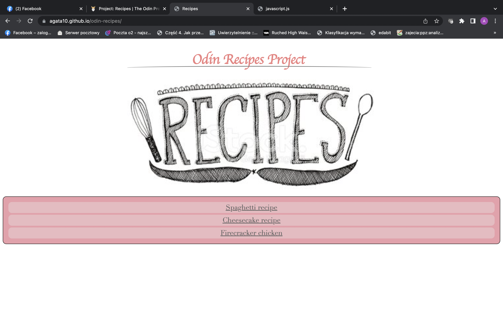
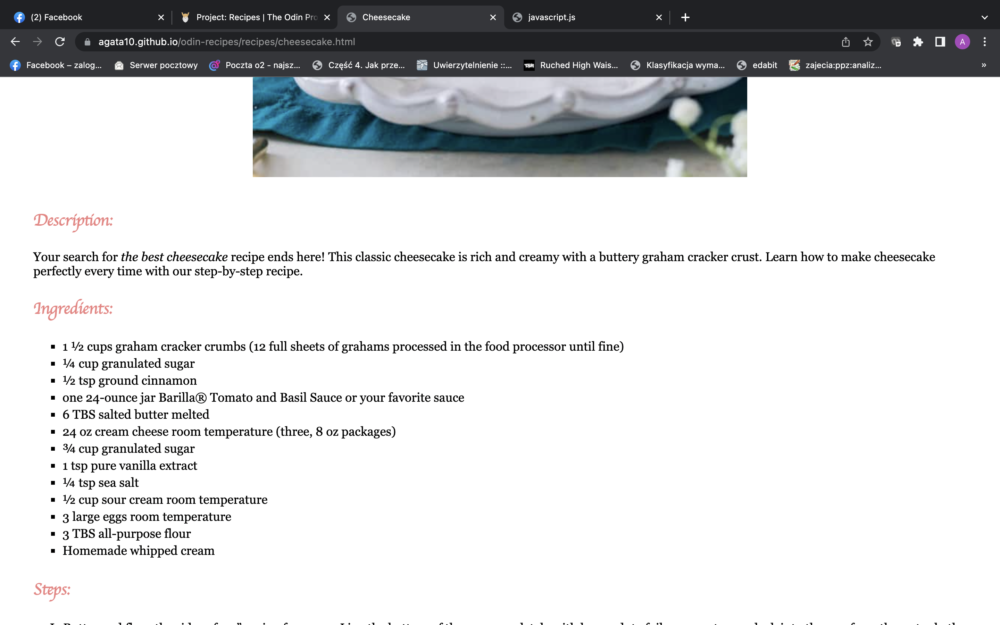

# odin-recipes
Odin HTML/CSS project with recipes!

In this project I will present my basic HTML skills creating basic recpie webpage.

I will try to use headings, paragraphs, lists, images and links. 

# My fist webpage 

## Table of Contents
* [General Info](#general-information)
* [Technologies](#technologies)
* [Screenshots](#screenshots)
* [Setup](#setup)
* [Usage](#usage)

## General information
It's my first webpage using HTML5 and CSS3. It's a recipes webpage as one of the task from [The Odin Project](https://www.theodinproject.com/lessons/foundations-recipes) .

## Technologies
* CSS3
* HTML5

## Link to webpage
https://agata10.github.io/odin-recipes/

## Screenshots

## Setup

1. Fork repository
or
2. Clone reposiory
   `git clone https://github.com/YOUR-USERNAME/YOUR-REPOSITORY`

## Usage

This is the basic webpage. The main goal was to learn how to connect css with html and to use headings, paragraphs, lists, images and links. 